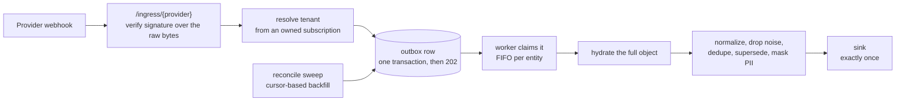

# Lawang

**Permission-aware SaaS connectors for AI memory.**

*Lawang* is Javanese for door or gate: the thing every change passes through, and where it is
decided who may see it.

Lawang connects a workspace's SaaS tools (Slack, Microsoft Teams, Outlook, ClickUp, HubSpot),
receives their webhooks directly, and turns every change into a clean, permission-stamped record
delivered exactly once to your memory, search, or RAG system.

> **Status: pre-alpha.** The foundations are built (M0: configuration, id recipes, Postgres with
> row-level security, the outbox), the record format is settled
> ([schema](internal/record/record.v1.schema.json)), and the webhook edge now exists: the provider
> interfaces, the registry and `/ingress/{provider}` with raw-body capture, a size cap and the
> handshake hook. What is still missing is the half that makes a delivery belong to somebody:
> signature verification against owned subscriptions, and the outbox insert. So no webhook is
> stored yet, **and `lawang serve` does not mount the route at all**: an edge with no hub would
> answer a provider without storing anything, so B07 is the item that wires it and until then a
> POST to `/ingress/{provider}` is a 404 from the mux. The design
> is written down in [docs/architecture.md](docs/architecture.md), the build order in
> [docs/roadmap.md](docs/roadmap.md),
> and day-to-day progress in [docs/backlog.md](docs/backlog.md). The first release, v0.1.0, is the
> point where it runs end to end against real providers.

---

## Why another connector project

Most connector tools move data. Lawang controls **what gets through and who may see it**, which
is the part that matters once the data lands in something an AI agent reads.

- **Permission-stamped at the source.** Every record carries a scope (the channel, list, mailbox or
  portal it came from), taken from the provider's own sharing signals. The scope's members are
  not in the record: they are synced separately, under the same scope id, so when somebody joins
  or leaves a channel no record has to be delivered again. Your retrieval layer enforces one rule:
  a person may see a record if they are a member of its scope. Lawang never guesses reach from
  content.
- **Exactly once, end to end.** Each change gets one deterministic id. A provider re-sending a
  webhook, a worker crashing mid-delivery, and a backfill overlapping the live feed all resolve to
  the same id, so all three are no-ops downstream.
- **Webhooks first, reconciliation always.** Live events give you freshness. Cursor-based
  reconciliation fills the gaps webhooks leave, because they always leave gaps: endpoints get
  disabled, subscriptions expire, and some providers never redeliver.
- **Tenant isolation by construction.** Postgres row-level security on every table, fail closed.
  An incoming webhook's tenant comes from a subscription row Lawang owns, never from the
  payload, and a delivery that more than one tenant could claim is refused rather than routed.
- **No broker.** One Postgres, an outbox table, and a worker. The hand-off between accepting a
  webhook and delivering a record is a database row, so there is nothing else to run or lose.
- **Credentials held safely.** A local encrypted vault by default, or a self-hosted
  [Nango](https://github.com/NangoHQ/nango) instance. Raw tokens never sit in a plain table.

## How it works

The accept path is fast and does no provider I/O: verify, resolve, insert, respond. Everything
slow (fetching the full object, normalizing, delivering) happens in the worker, where a failure
retries on a backoff ladder and eventually parks as a replayable dead-letter state instead of
getting lost.

## Providers planned for v0.1

| Provider | Ingest | Where visibility comes from |
|---|---|---|
| ClickUp | webhook (one per workspace) | list members |
| Slack | Events API | channel members; DM participants |
| Microsoft Teams | Graph subscription, renewed hourly | channel members |
| Outlook | Graph subscription per mailbox, renewed | the mailbox owner |
| HubSpot | reconcile-only by default, webhooks optional | portal owners |

Adding a provider means adding one Go package that implements a small set of interfaces. See
[docs/architecture.md](docs/architecture.md#extension-points).

## What Lawang is not

- **Not a general ETL tool.** For bulk analytics pipelines use something like Airbyte. Lawang is
  built for change-by-change ingestion where permissions travel with the data.
- **Not an auth product.** It can use Nango for OAuth and token refresh rather than reinventing it.
- **Not a vector database.** It delivers records to whatever you index them in.

## Why Go

A connector service is mostly a webhook edge and a set of long-running workers. Go fits that
shape: one static binary, small container images, strong standard-library HTTP and crypto
(constant-time HMAC comparison included), and goroutines that let the drain loop and each
maintenance sweep run independently. That last point is a lesson from the Python predecessor,
where a long reconciliation pass in a single sequential loop blocked live delivery.

## Documentation

- [Architecture](docs/architecture.md): the target design, trust model, record format, and
  extension points
- [Roadmap](docs/roadmap.md): milestones, acceptance criteria, and open decisions
- [Backlog](docs/backlog.md): the milestones cut into work items, with the current 30-day plan

## License

[Apache License 2.0](LICENSE)
