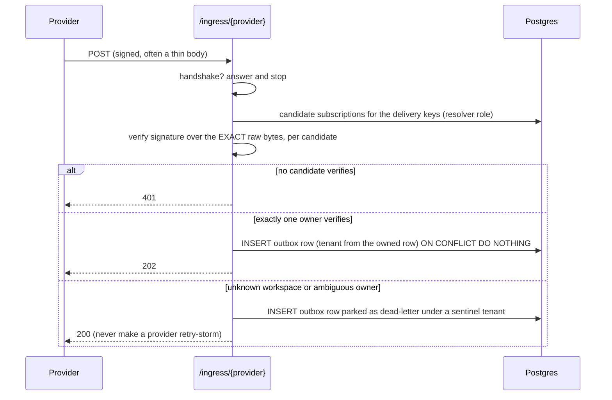

# Architecture

This is the target design for Sluiceway v0.1. It is a Go rewrite and generalization of a Python
connector service that ran against real Slack, Microsoft Teams, Outlook, ClickUp and HubSpot
tenants. The shape carries over because it held up; the places where it did not are called out in
[section 10](#10-design-principles-learned-the-hard-way), and each one changed the design below.

Build order and open decisions live in [roadmap.md](roadmap.md).

---

## 1. Goals and non-goals

**Goals**

1. Ingest changes from SaaS tools with webhooks as the primary path and reconciliation as the
   safety net.
2. Stamp every record with its visibility (a scope) from the provider's own sharing signals, and
   sync each scope's members separately, under the same scope id
   ([section 3.4](#34-access-sync)).
3. Deliver each change to a sink exactly once, surviving provider re-sends, worker crashes and
   backfill overlaps.
4. Isolate tenants at the database level, failing closed.
5. Run as a single binary against a single Postgres, with no third-party account required for a
   local setup.

**Non-goals for v0.1**

- Acting on providers (posting messages, creating tasks). The design leaves room for a tool-calling
  facade later; v0.1 is ingestion only.
- Bulk analytics replication. That is a different problem with different tools.
- Hosting OAuth consent screens. Sluiceway can delegate that to Nango.

---

## 2. Shape

One binary, two roles, one database.

| Role | Command | What it does | Scaling |
|---|---|---|---|
| **serve** | `sluiceway serve` | Operator API under `/v1` and the webhook edge under `/ingress/{provider}` | Horizontal and stateless: verification and accept need only Postgres |
| **worker** | `sluiceway worker` | Drains the outbox, renews subscriptions, reconciles, syncs access, sweeps retention | Horizontal: rows are claimed with `FOR UPDATE SKIP LOCKED`; cluster-wide sweeps elect a single runner with an advisory lock |

Other subcommands: `migrate`, `connect <provider>`, `reconcile <tenant> <provider>`, `version`.

There is **no message broker**. The only queue is the `outbox` table. Retries and the dead-letter
queue are row states, not topics, so replaying a dead letter is an `UPDATE`, not a re-publish.

---

## 3. Data flows

### 3.1 Accept path (inside `serve`, target under 200 ms)



Response codes are part of the contract: **401 only for a signature failure**, 2xx for everything
else including poison, because providers retry non-2xx responses and a retry storm helps nobody.

### 3.2 Drain path (inside `worker`)

1. Claim rows with `FOR UPDATE SKIP LOCKED`, only the **head** of each ordering key, so the
   versions of one entity deliver one at a time, in queue order, while different entities proceed
   in parallel.
2. Commit the claim, then open a **second transaction** as the application role, bound to the
   row's own tenant, before touching anything that belongs to a tenant. The claim runs as
   `sluiceway_worker`, and that transaction is cross-tenant for its whole life: Postgres ORs
   permissive policies together, so binding a tenant inside it would take nothing away (see
   [section 4](#4-trust-model)).
3. Parse the stored raw body into changes. One delivery can produce several records (a comment and
   its parent task, for example).
4. Hydrate each change into the full object. On failure, degrade to a minimal record built from the
   webhook body rather than dropping the change.
5. Normalize, drop automation noise, compute the record id, skip ids already in the ledger, link
   the supersede chain forward only, mask PII.
6. Commit the ledger rows and the prepared records together, then deliver to the sink.
7. Commit the delivered state. A crash between steps 6 and 7 re-drains the prepared records, and
   the sink's idempotency turns the repeat into a no-op.

**Outbox row states.** `pending` to `prepared` (step 6) to `delivered` (step 7), or to `dead`. A
claim is a **lease** (`lease_until` plus a `lease_token`), not a held lock, because the work spans
two transactions and a sink call; a worker that dies lets its lease run out and another takes
over. Every transition is guarded by the lease token, so a slow worker that comes back after a
takeover changes nothing. The head of an ordering key is its row with the lowest `seq` that is
`pending` or `prepared`: while the head is leased or waiting out a backoff, nothing behind it is
claimable, so two versions of one entity are never in flight together. A `dead` row is finished
and does not hold back newer versions of its entity.

**The head is stored, not computed** ([ADR 10](adr/0010-outbox-head-marker.md)). Each row has an
`is_head` marker, true for exactly the head of its key, and the claim walks an index of heads in
the order they fall due (`due_at`, which is the later of the backoff and the lease) and stops at
its batch. A poll therefore costs what it returns. It never visits the rows waiting behind a head,
the heads waiting out a backoff, or the heads other workers hold, so a sink outage or a backfill
with a million rows waiting does not make finding work any dearer: a batch of 10 takes about 0.3
ms there, where a claim that worked the heads out on every poll took 4 seconds, and 0.4 seconds
to find that nothing was due.

The marker is kept by the writers, and guarded by the database. An accepted or replayed row is
the head if its key has nothing unfinished, and the transition that finishes a head
(`delivered` or `dead`) hands the marker to the next row of the key in the same transaction. A
unique index allows one head per key and a CHECK says a head is unfinished, so "never two
versions of one entity in flight" does not depend on every writer getting it right: a row that
reached the table any other way is simply not a head, and waits.

**Queue order.** `seq` is assigned when a row is inserted, not when its transaction commits. Left
alone, version 1 could be inserted first and commit last, and a claim in between would lease
version 2 and then version 1 alongside it. So every statement that assigns a `seq` first takes a
transaction-scoped advisory lock on a hash of (tenant, ordering key): within one key, accepts
commit in `seq` order, and a second accept of the same entity waits for the first to commit.
Different entities do not wait for each other (two keys that hash alike do, harmlessly). A
transaction that accepts several deliveries holds several of these locks until it commits, so it
should accept in a stable key order or be ready to retry a deadlock.

The same lock keeps the head marker. The transitions that finish a row take it too, before
anything else, so the writers of one key (accept, replay, delivered, dead) run strictly one
after the other. Without that, an accept and a finish of the same entity can miss each other: the
accept sees version 1 unfinished and stores version 2 as a non-head, while the finish of version 1
cannot yet see version 2 and hands the marker to nobody, and version 2 is never delivered. The
lock always comes before any row lock, and the claim takes no advisory lock and never waits for a
row (`SKIP LOCKED`), so nothing can deadlock on it. The price is that finishing a row waits for
an accept of the same entity that is still open, which is one more reason to keep accepting
transactions short.

Waiting is only half of it: the writer that waited must also see what the one before it
committed, and it does because its next statement takes a new snapshot. That is READ COMMITTED.
Under REPEATABLE READ the same writers wait and then decide on a snapshot from before the wait,
and version 2 is stranded exactly as above, silently. So the store begins every transaction
`ISOLATION LEVEL READ COMMITTED` by name, and a `default_transaction_isolation` set on the server,
the database or the role cannot change it (ADR 10).

**Replay goes to the back.** Replaying a dead letter gives the row a fresh `seq`, under the same
lock, as if it had just been accepted, and like an accepted row it is the head only if its entity
has nothing unfinished. While it was dead, newer versions of its entity were free to move, and one
may be in flight at the moment of the replay: a row that kept its old `seq` would be the earliest
unfinished row again, ahead of the version in flight. The replayed version is therefore
delivered after every version accepted before the replay, and the forward-only supersede chain
treats it like any other late arrival of an old version. A row that died after step 6 remembers
it (`prepared_at`) and is replayed as `prepared`, so it is delivered again but never prepared
again.

The claim picks its rows on its statement snapshot and leases each on its latest version, so it
re-checks on the locked row everything that can change in between: the marker, and `due_at` (the
lease and the backoff). Both are columns of the locked row itself, so the re-check never compares
against anything stale. The claim does not look at the state: the CHECK makes every head
unfinished, and a condition that repeats it misleads the planner into reading every waiting row
(ADR 10). The second line of defense is the unique index: whatever a writer does, a key cannot
have two heads, so it cannot have two rows in flight.

The claim runs as `sluiceway_worker`, which is granted only what it reads (`id`, `seq`,
`tenant_id`, `is_head`, `attempts`, `due_at`) and may update only the lease. It cannot read
`raw_body`, a row's state, or which entity a row belongs to, it writes `lease_token` without
being able to read one back, and it cannot write `is_head`, so it can lease a head but never make
one. Payloads are read afterwards, as the application role bound to the claimed row's tenant.

**What a failure leaves behind.** `last_error` and `dead_reason` are plain text that operators
read and every backup carries, so they never hold token material, a URL, or text written by a
remote system. The outbox does not take an error string at all. A failure is recorded as an
`outbox.Cause`: one of the outbox's own classifications (section 11), the HTTP status, and the
remote system's error code if it looks like one (short, and nothing but letters, digits, `_`, `-`
and `.`), otherwise the word "withheld". The reason is the obvious call it rules out: the error
of an HTTP client quotes the request URL, and the query string is where many sinks and providers
carry their API key.

### 3.3 Reconciliation

A per-tenant, per-provider cursor records the newest change already seen. A reconcile pass asks the
provider what changed since the cursor and replays each change **through the same accept path**
as a trusted synthesized delivery. There is no separate backfill pipeline: overlaps with the live
feed dedupe on the record id like any other repeat.

Passes commit in chunks and take their rate-limit pauses between chunks, never inside an open
transaction (see [section 10](#10-design-principles-learned-the-hard-way)).

### 3.4 Access sync

Per provider, a member source lists each container (channel, list, mailbox, portal) and its members.
Sluiceway maps members to person ids through an identity resolver, diffs against what it last sent,
and pushes grants and revocations to sinks that accept membership. A failed provider read aborts
the pass rather than being treated as an empty member list, because an outage must never look like
everybody leaving.

---

## 4. Trust model

Three roots of trust, and nothing else can establish a tenant:

| Surface | Trust root | Tenant comes from |
|---|---|---|
| `/v1` operator API | operator credential | the credential |
| `/ingress/{provider}` | provider signature over the raw bytes | the owned subscription row that verified it |
| sink delivery | per-tenant sink credential | Sluiceway, from the outbox row |

**Row-level security.** Every tenant-scoped table has RLS enabled and forced, with the policy keyed
on a transaction-local setting. If the setting is missing, a query returns zero rows. Three roles:

| Role | Purpose |
|---|---|
| `sluiceway` | the application role; `NOSUPERUSER NOBYPASSRLS`, so RLS actually applies |
| `sluiceway_resolver` | reads only the delivery-resolution columns of subscriptions, because it has to derive the tenant and so cannot be filtered by it |
| `sluiceway_worker` | claims outbox rows across tenants, in a transaction that does nothing else; the work on each row then runs in a second transaction, as `sluiceway`, bound to that row's tenant |

The resolver and worker roles are granted with `INHERIT FALSE` and entered explicitly with
`SET LOCAL ROLE`, so the application role does not silently pick up their wider policies.

**A helper-role transaction is cross-tenant until it ends.** Permissive policies are ORed together,
so once a helper role's policy applies (`TO sluiceway_worker USING (true)`, for example), binding a
tenant in the same transaction narrows nothing: every tenant's rows stay visible, and updatable
where the role may update. A bind could only add rows, on tables where the role has no policy of
its own. The rule is therefore two transactions: the cross-tenant step (resolve an owner, claim a
row) under the helper role, and everything that belongs to a tenant in a second transaction as the
application role bound to that tenant. The code enforces it: the transaction `store.RoleTx` hands
out refuses `tenancy.Bind`, savepoints included.

**Bootstrap and preflight.** The application role cannot create roles, so an administrator applies
a one-time bootstrap script (`sluiceway migrate bootstrap` prints it) that creates the three roles
and a `sluiceway` schema owned by the application role. The administrator is a superuser, or a
non-superuser with `CREATEROLE` and `CREATE` on the database, which is what managed Postgres
offers. The script is a single statement, so it applies completely or not at all, and it is safe
to run again, also as a different administrator. It leaves the administrator's own role
memberships exactly as it found them, and it refuses a database where a `sluiceway` schema already
exists under another owner. Migrations then run as the application role itself. Every connection sets `search_path` to that schema explicitly, because the default
`"$user"` entry follows `SET ROLE`.

On every start, `serve`, `worker` and `migrate` run a preflight and refuse to continue if:

- the login is `SUPERUSER` or `BYPASSRLS` (row-level security would silently not apply), or a
  helper role is;
- the login **inherits** a helper role, by any path. The preflight does not read membership rows,
  because there is one per grantor and inheritance also arrives through intermediate roles. It asks
  Postgres the effective question, `pg_has_role(helper, 'USAGE')`, which must be false: otherwise
  a plain transaction with no tenant bound would run under the helper role's cross-tenant
  policies;
- the login holds **`ADMIN OPTION`** on a helper role, by any path, inherited or not
  (`pg_has_role(helper, 'MEMBER WITH ADMIN OPTION')` must be false). That is the one membership
  state the application role could turn into inheritance by itself, by granting the helper role
  to itself `WITH INHERIT TRUE` while the process runs;
- the login cannot `SET ROLE` to a helper role (`pg_has_role(helper, 'SET')` must be true);
- the schema is missing (the bootstrap was not applied), or exists but is not owned by the login
  role (it is not the one the bootstrap creates, and migrations would fail in it with a misleading
  error), or the server is older than Postgres 16.

The preflight runs once per process, at start. It guards against misconfiguration, not against an
administrator: a membership or attribute changed while the process runs is not seen until the next
start, and anyone able to make that change could read the tables directly anyway.

**No part of the database URL reaches a log or an error**, not only the password. The driver and
the server both quote the connection target when a connection fails (user, database, host, port,
client address), so a failure to connect is reduced to its classification: the host name does not
resolve, connection refused, timed out, authentication failed or no such database (with the
SQLSTATE, and never the server's message), TLS failure, or other, always prefixed with
`SLUICEWAY_DATABASE_URL`. The same holds for a connection that fails later, in the middle of a
transaction or a migration, while an error from a statement that ran (a constraint violation, a
failed migration) keeps the server's message. Preflight refusals say "the login role", not its
name. One connection attempt is bounded at 10 seconds unless the URL sets `connect_timeout` to 1
or more (seconds), so a host that silently drops packets is reported instead of holding the start
for the TCP timeout of the operating system. `connect_timeout=0`, which means "wait forever" to
libpq, does not lift the bound: the driver cannot tell it from a missing parameter, and a bounded
start is the safe reading of the two. An operator who needs a long wait writes a large number.

The replacement judges the error, not where it came from. A network error that a transaction
function returns is reduced in the same way, along with anything the function wrapped around it,
because a statement on a connection that has just died fails with exactly such an error. So a
transaction function does database work only: no provider call, no sink delivery, no lookup inside
it, which principle 6 of section 10 asks for anyway.

See [ADR 2](adr/0002-migrations-goose.md).

**Tenant ids** are 1 to 64 characters of `A-Z a-z 0-9 _ -`, enforced in Go and by a `tenant_id`
domain that every tenant column uses. The policy compares against `current_tenant()`, which maps
both an unset setting and the empty string to `NULL`: a transaction-local setting reads back as
`''` on a pooled connection after its transaction ends, and neither may match a row.

---

## 5. Idempotency

Three deterministic keys, minted in exactly one package (`internal/ids`) so the recipes cannot drift:

| Where | Key | Effect |
|---|---|---|
| accept | `delivery_id = blake3(provider, raw_body)`, unique per tenant | an identical re-send is an accept no-op |
| record | `id = "rec_" + blake3(provider, external_id, version, scope, tenant)[:32]` | worker re-drains, backfill overlaps and cosmetically different re-sends all collapse to one id |
| subscription | unique on `(tenant, provider, resource)` | re-registering updates in place, never duplicates |

Parts are joined with a `0x1F` separator so `("ab","c")` never collides with `("a","bc")`. A part
that is empty or itself contains `0x1F` is refused with an error rather than hashed: an empty tenant
must never mint an id, and a separator inside a part would bring the collision back. The raw body of
a delivery is exempt because it is the last part. Test vectors for both recipes are in
`internal/ids/testdata/golden.json`.

The delivery id is unique **per tenant**, not globally, for the same reason the record id is salted
(below): two tenants may connect one provider workspace, and reconciliation then synthesizes
byte-identical deliveries for both. A global constraint would drop the second tenant's.

The **tenant** is part of the record id on purpose: two tenants can legitimately connect the same
provider workspace, and without the salt the second tenant's records would dedupe away as
duplicates of the first. The tenant participates only in the hash.

The **scope** (the record's `visibility.scope`, [section 6](#6-the-record-format)) is part of the
record id as well ([ADR 4](adr/0004-record-format-v1.md)). An entity that moves to another scope,
a task to another list, is decided on different members from then on, and the provider's own
version does not have to change with the move. Without the scope in the hash the moved record
would keep its id, the ledger would skip it as already delivered, and the sink would go on
deciding access on the old scope, with no error anywhere. `record.Seal` is the only caller of the
recipe, and it hashes the scope the record carries.

A **new version is a new record.** Edits never overwrite; the new record carries `supersedes`, the
id of the version it replaces. Supersede links only point forward, so a late-arriving old version
can never claim to replace a newer one.

---

## 6. The record format

This is the envelope a sink receives: format **v1**, settled in
[ADR 4](adr/0004-record-format-v1.md), with the scope id inside it settled in
[ADR 3](adr/0003-scope-id-format.md). It is a public contract from v0.1 on. The contract itself
is the JSON Schema (draft 2020-12),
[`internal/record/record.v1.schema.json`](../internal/record/record.v1.schema.json): that is the
file a sink author takes, and the binary embeds the same bytes. The Go types are in
`internal/record`.

```json
{
  "format": "sluiceway.record/v1",
  "id": "rec_bb4dc9bd2347887adae051e72346bec6",
  "op": "upsert",
  "source": "slack",
  "kind": "message",
  "external_id": "slack:C0GENERAL:1752064245.000200",
  "version": "1752064245.000200",
  "supersedes": null,
  "occurred_at": "2026-07-09T12:30:45Z",
  "title": "",
  "text": "Numbers are in, call me at [PHONE]",
  "author": { "id": "U0BEN", "display": "ben" },
  "container": { "kind": "channel", "id": "C0GENERAL" },
  "visibility": { "scope": "slack:channel:C0GENERAL", "audience": "group" },
  "origin": { "automation": false, "untrusted": false },
  "edges": { "reply_parent": null },
  "meta": { "delivery": "01JZXA8Q2K4M7N9P0R3S5T6V8W" }
}
```

A test keeps this example and the fixture the schema tests run on identical, so the example is
always a record the schema accepts and the Go types produce.

| Field | | What it is |
|---|---|---|
| `format` | required | `sluiceway.record/v1`, exactly. How a sink learns what it is reading, also from a file or a queue. |
| `id` | required | The idempotency key, `rec_` and 32 hex characters ([section 5](#5-idempotency)). One id is one version of one entity in one scope, for one tenant. |
| `op` | required | `upsert`, or `delete`: a tombstone with empty `title` and `text`. `delete` is part of v1 so that shipping deletions does not change the format; v0.1 never sends one. |
| `source` | required | The name the sink knows the source by. Sink configuration (principle 4), so it is in no id and need not match the first segment of the scope. |
| `kind` | required | `task`, `message`, `ticket`, `document` or `page`. A closed set. |
| `external_id` | required | The entity's identity at the source, the same for every version. Opaque. |
| `version` | required | Names this version. Opaque to a sink: equal or not equal. The provider's normalizer promises it changes when the entity changes and never goes backwards for one `external_id`; the format cannot check that. |
| `supersedes` | required, may be null | The `id` of the record this one replaces. Forward only. |
| `occurred_at` | required | Source event time, never ingest time. RFC 3339, always UTC with `Z`, up to nine fractional digits. |
| `title`, `text` | required, may be empty | Already PII-masked. At most 1,024 and 1,048,576 characters. Untrusted content by nature. |
| `author` | required | `id` is the provider's own user id, as the provider spells it, and `display` a name to show. Either may be empty when the source does not say. Informational: **access is never decided on the author**, and `author.id` is not the person identifier that membership uses. |
| `container` | required | `kind` and `id` of where the entity lives at the source (the channel of a message, the task of a comment). Often what the scope is made of, and not always. |
| `visibility.scope` | required | **The one thing access is decided on.** A scope id (ADR 3), always built from the internal provider key. |
| `visibility.audience` | required | `direct` (named participants: a DM, a mailbox) or `group` (a shared space). Informational only: it grants and denies nothing. |
| `origin` | required | `automation`: a bot or an integration wrote it. `untrusted`: somebody outside the tenant wrote it. |
| `edges.reply_parent` | required, may be null | The `external_id` of the entity this one replies to. Relations come from fields, never from NLP. |
| `meta` | may be absent | Diagnostics (`delivery`: the accepted delivery the record was made from). Not part of the record's content. |

**Reading rules for a sink.** Refuse a `format` you do not know. Be idempotent on `id`. Decide
access on `visibility.scope` and nothing else, keyed by tenant and scope together, because the
tenant is deliberately not in the envelope or in the scope id: it arrives beside the records,
established by the per-tenant sink credential ([section 4](#4-trust-model)). Compare `id`,
`external_id`, `version` and `visibility.scope` for equality only, never parse them. Ignore fields
you do not know, **except inside `visibility`**, which is closed: an unknown field there could only
be one that must not be ignored, so it is a reason to refuse the record. Field names are lowercase
`a-z 0-9 _`, now and later, and a record with any other field name is refused (some decoders match
names without regard to case, and would read `ID` beside `id` as the same field).

**What may change.** Within v1, only fields a reader may ignore are added. A field removed or
renamed, a changed meaning, a new `op`, `kind` or `audience`, and any change inside `visibility`
make a new format with a new `format` value and a new schema `$id`.

**The visibility rule is uniform: a person may see a record if they are a member of its scope.**
There is deliberately no `private` flag. A DM is a scope whose members are its participants; a
mailbox is a scope whose only member is its owner; a channel is a scope whose members are the
channel's members. One rule, applied the same way for every provider, is far harder to get wrong
than a per-container flag whose meaning a sink can interpret differently from the connector
(see principle 9).

Sluiceway **never** stamps anything as public. Content from a connector reaches exactly the people
who could see it in the source tool, and no further.

A record carries its scope and **never the scope's members**. Members travel separately, through
access sync ([section 3.4](#34-access-sync)), under the same scope id, which is the join key
between the two. That is why somebody joining or leaving a channel never causes a record to be
delivered again, and why no content hash can hide a permission change: permissions are not in the
content to begin with. The membership message and the person identifier in it are decided with
B23 and B24, not here (ADR 4).

**A record that moves to another scope is a new record.** A task moved to another list, or a
message moved to another channel, is decided on a different scope, so its `visibility.scope`
changes, and the scope is part of the record id ([section 5](#5-idempotency)): the moved record
gets a new `id` even when the provider's own version did not change with the move, the ledger
does not skip it, and it names what it was in the old scope in `supersedes`, so the sink replaces
it and the old scope's members lose it.

`origin.untrusted` exists from day one because records authored by people outside the tenant, such
as inbound email or external Slack guests, can carry text written to steer a downstream AI agent.
Marking them at the connector boundary, the only place that knows, lets the sink treat them with
suspicion.

---

## 7. Extension points

Each is a small Go interface wired once at startup. Optional capabilities are separate interfaces a
provider implements only if it has them, discovered with a type assertion rather than stubbed out.

```go
// Provider is one SaaS integration. Everything provider-specific lives in its own package.
type Provider interface {
	Key() string                                                   // "slack"
	Hydrate(ctx context.Context, t Tenant, c Change) (Hydrated, error)
	Normalize(h Hydrated, c Change) ([]Record, error)
}

// Optional capabilities.
type WebhookSource interface {
	Handshake(r *http.Request, body []byte) (Reply, bool)          // challenge echoes
	DeliveryKeys(body []byte, h http.Header) (DeliveryKeys, error) // what resolves the owner
	Verify(body []byte, h http.Header, secret []byte) bool         // never errors, never panics
	Parse(body []byte) ([]Change, error)
}
type Registrar interface {
	Register(ctx context.Context, t Tenant, cred Credential) ([]Subscription, error)
	Renew(ctx context.Context, s Subscription) (Subscription, error)
	Deregister(ctx context.Context, s Subscription) error
}
type Reconciler interface {
	ChangesSince(ctx context.Context, s Subscription, cursor Cursor, limit int) ([]Change, error)
}
type MemberSource interface {
	Scopes(ctx context.Context, s Subscription) ([]ScopeMembers, error) // fails loudly, never empty-on-error
}

// Vault holds provider credentials. Raw tokens never reach a plain table.
type Vault interface {
	Store(ctx context.Context, t Tenant, provider string, c Credential) error
	Fetch(ctx context.Context, t Tenant, provider string) (Credential, error)
	Revoke(ctx context.Context, t Tenant, provider string) error
}

// Sink receives records. It must be idempotent on Record.ID.
type Sink interface {
	Deliver(ctx context.Context, t Tenant, recs []Record) (DeliveryResult, error)
}
type AccessSink interface {
	SyncMembership(ctx context.Context, t Tenant, grants []Membership) (SyncResult, error)
}
```

Built-in implementations planned for v0.1:

| Seam | Implementations |
|---|---|
| Vault | `local` (AES-GCM, key from the environment), `nango` (self-hosted), `azureapp` (client-credentials for Microsoft Graph) |
| Sink | `http` (the format above), `stub` (strict test double), `jsonl` (files, for development) |
| Hydration | direct provider API clients; an MCP-backed hydrator is on the roadmap as an alternative |
| Identity | email join (normalized, domain-restricted); replaceable |
| Masking | conservative regex baseline (emails, phone numbers, IBANs); replaceable |

---

## 8. Package layout

```text
cmd/sluiceway/        main: serve | worker | migrate | connect | reconcile | version
internal/
  appversion/         the release version set by the linker, or the VCS revision of a dev build
  config/             environment config, fail-closed defaults
  ids/                ULIDs and the blake3 key recipes, golden-tested
  record/             the record format: Go types, validation, the scope id, the embedded JSON Schema
  tenancy/            tenant context and RLS binding
  store/              pgx pool, preflight, transaction helpers, migrate
  testdb/             a real Postgres for integration tests, as the application role
  outbox/             accept insert, FIFO-head claim, retry ladder, dead letters
  ingress/            the /ingress/{provider} HTTP edge
  hub/                handshake, verify, resolve owner, accept
  pipeline/           normalize, gate, ledger, supersede, mask, deliver
  worker/             drain and sweeps as independent goroutines
  reconcile/          cursors and chunked replay
  access/             membership diff, identity resolution
  api/                the /v1 operator API
  vault/              Vault interface and implementations
  sink/               Sink interface and implementations
  provider/           Provider interfaces and the registry
    clickup/  slack/  teams/  outlook/  hubspot/
migrations/           SQL, embedded into the binary; bootstrap/ is the one-time admin script
docs/
```

Code stays under `internal/` until the extension interfaces have been exercised by more than the
built-in providers. Promoting them to a public package is a compatibility promise, so it waits
until the shape has stopped moving.

---

## 9. Worker concurrency

The worker runs each concern as its own goroutine under one cancellable context:

- **Drain:** a small pool of goroutines, each claiming a batch with `SKIP LOCKED`. Adding worker
  replicas adds drain capacity with no coordination. That holds because a poll costs what it
  returns (section 3.2): it reads neither the backlog nor the rows other replicas have in flight,
  so more pollers do not mean more scanning of the same waiting rows, and an idle poll is a few
  pages. What does not scale with replicas is one entity: its versions deliver one at a time by
  design, so a single hot entity drains at the speed of one worker. The one standing cost is
  Postgres housekeeping: every lease, retry and finish leaves a dead entry at the front of the
  index the claim walks, until autovacuum removes them. Measured, that is 9 to 11 more pages per
  poll for every 1,000 rows delivered since the last vacuum (ADR 10). A
  long-running transaction anywhere in the database holds that cleanup back, which is one more
  reason for principle 6.
- **Sweeps** (renewal, reconcile, access sync, retention, dead-letter re-resolution): each on its
  own ticker. A sweep that must run once per cluster takes a Postgres advisory lock for its
  duration, so exactly one replica runs it and a crashed holder releases it automatically.
- **Shutdown:** cancel the context, stop claiming new rows, let in-flight rows finish their
  current transaction, then exit.

Because the drain and the sweeps are independent, a slow reconciliation pass cannot hold up live
delivery.

---

## 10. Design principles learned the hard way

Each of these came from a real defect or a near miss in the Python predecessor.

1. **Verify signatures over the exact raw bytes.** Re-serialized JSON never matches the provider's
   HMAC. Compare in constant time, and treat a missing secret or signature as a plain `false`.
2. **The tenant comes from an owned row, never from the payload.** When more than one tenant's
   secret verifies the same delivery, refuse it. Routing to the first match is how data crosses
   tenants.
3. **Salt the record id with the tenant.** Two tenants sharing one provider workspace otherwise
   collapse into one id and the second tenant silently loses records.
4. **The wire name is not the internal key.** What a sink calls a source is sink configuration.
   Hashing the internal key keeps record ids stable if the wire name ever changes.
5. **A test double must reject whatever the real system rejects.** A lenient stub let a whole class
   of silently mis-routed records pass every end-to-end test. The stub sink is strict on purpose.
6. **Never sleep inside a transaction, and never let a sweep block the drain.** A reconciliation
   pass that paced itself inside one long transaction held a write transaction open for minutes
   and stopped live delivery for its whole duration.
7. **A rate limiter must refuse a request it can never satisfy.** A token bucket asked for more
   tokens than its capacity spins forever instead of failing.
8. **Missing identity is a denial, not a default.** Falling back to a shared "default" namespace
   when a per-user key is absent mixes users' data without an error anywhere.
9. **Define visibility semantics in the format, not in the receiver.** A "private" flag that the
   connector meant as "only these participants" and the receiver read as "only the author" made
   records invisible to everyone while every system reported success. Hence the single uniform
   scope-membership rule in section 6.
10. **Webhooks drop; reconciliation is not optional.** Some providers never redeliver an event
    missed during an outage. A backfill path that shares the live pipeline is the only reliable fix.
11. **Verify each provider's tooling before depending on it.** Of five providers, three needed a
    direct API client because the off-the-shelf MCP server either required delegated user tokens
    or exposed no read tools. Direct clients are therefore the default here.
12. **Test migrations as the role that will run them in production.** A guard that only fired for a
    non-superuser passed every test run as superuser and blocked the first real deploy.

---

## 11. Failure handling

| Failure | Class | Action |
|---|---|---|
| Signature invalid | untrusted | 401, nothing stored |
| Unknown workspace or ambiguous owner | unattributable | parked under a sentinel tenant, re-resolved periodically, deleted after retention |
| Hydration fails | degradable | deliver a minimal record, the change is still tracked |
| Normalizer fails | non-retryable | dead-letter with the reason; fix and replay |
| Sink rejects one record | non-retryable | that record dead-letters; the rest of the batch lands |
| Sink rejects the credential (401) or lacks a grant (403) | halt | the row stays prepared; nothing is marked delivered; ops is alerted |
| Sink 5xx, timeout, connection error | retryable | backoff ladder, then dead-letter; replay is always safe |
| Vault unreachable | fail closed | retry on the ladder; nothing is delivered unverified |

---

## 12. Key dependencies

| Need | Choice |
|---|---|
| Postgres driver | `github.com/jackc/pgx/v5` |
| Migrations | `github.com/pressly/goose/v3`, SQL files embedded in the binary |
| Queries | `sqlc` generating `pgx/v5` code, checked in ([ADR 1](adr/0001-queries-sqlc.md)) |
| Hashing | `github.com/zeebo/blake3` |
| IDs | `github.com/oklog/ulid/v2` |
| HTTP | standard library `net/http` with method and path patterns |
| Logging | standard library `log/slog` |
| Crypto | standard library `crypto/hmac`, `crypto/aes`, `crypto/cipher` |
| Metrics | `github.com/prometheus/client_golang` |
| Tests | standard `testing`, `testcontainers-go` for Postgres |
| JSON Schema validation | `github.com/santhosh-tekuri/jsonschema/v6`, in tests only: pure Go, draft 2020-12, asserts formats on request, and the one module it builds with (`golang.org/x/text`) was already in the module graph. The `sluiceway` binary does not link it. Production code validates with `record.Validate`, which the tests hold equal to the schema. It becomes a runtime dependency only if the strict stub sink (B09) validates with the schema itself |
| MCP (later) | `github.com/modelcontextprotocol/go-sdk` |
