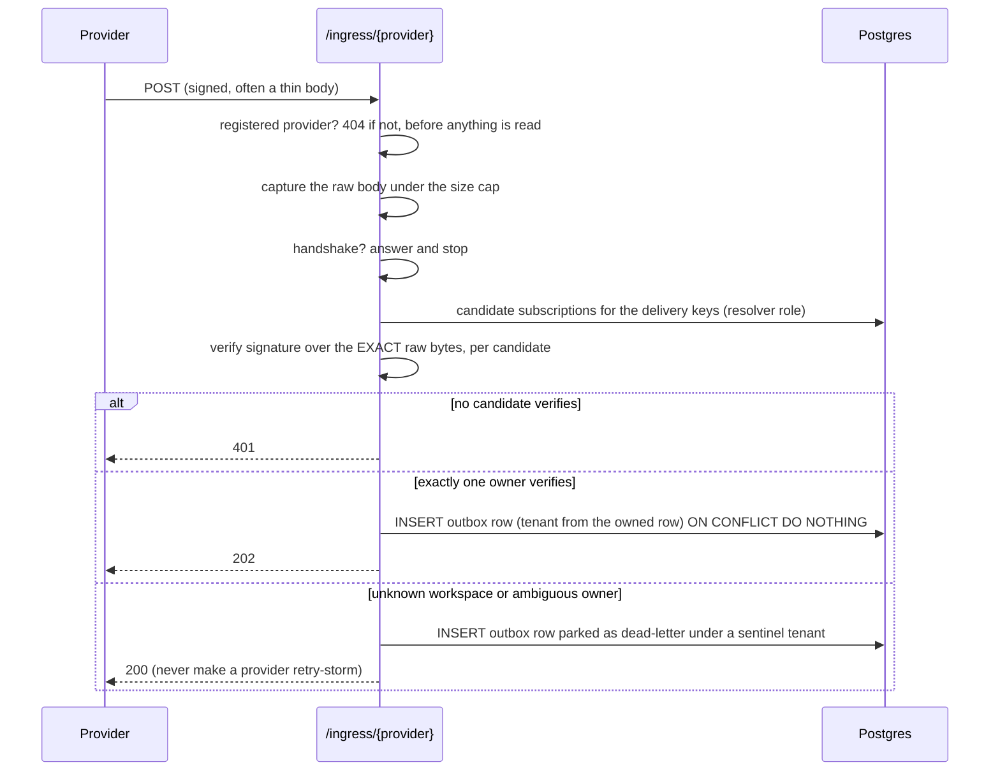

# Architecture

This is the target design for Lawang v0.1. It is a Go rewrite and generalization of a Python
connector service that ran against real Slack, Microsoft Teams, Outlook, ClickUp and HubSpot
tenants. The shape carries over because it held up; the places where it did not are called out in
[section 10](#10-design-principles-learned-the-hard-way), and each one changed the design below.

Build order and open decisions live in [roadmap.md](roadmap.md).

---

## 1. Goals and non-goals

**Goals**

1. Ingest changes from SaaS tools with webhooks as the primary path and reconciliation as the
   safety net.
2. Stamp every record with its visibility (a scope) from the provider's own sharing signals, and
   sync each scope's members separately, under the same scope id
   ([section 3.4](#34-access-sync)).
3. Deliver each change to a sink exactly once, surviving provider re-sends, worker crashes and
   backfill overlaps.
4. Isolate tenants at the database level, failing closed.
5. Run as a single binary against a single Postgres, with no third-party account required for a
   local setup.

**Non-goals for v0.1**

- Acting on providers (posting messages, creating tasks). The design leaves room for a tool-calling
  facade later; v0.1 is ingestion only.
- Bulk analytics replication. That is a different problem with different tools.
- Hosting OAuth consent screens. Lawang can delegate that to Nango.

---

## 2. Shape

One binary, two roles, one database.

| Role | Command | What it does | Scaling |
|---|---|---|---|
| **serve** | `lawang serve` | Operator API under `/v1` and the webhook edge under `/ingress/{provider}` | Horizontal and stateless: verification and accept need only Postgres |
| **worker** | `lawang worker` | Drains the outbox, renews subscriptions, reconciles, syncs access, sweeps retention | Horizontal: rows are claimed with `FOR UPDATE SKIP LOCKED`; cluster-wide sweeps elect a single runner with an advisory lock |

Other subcommands: `migrate`, `connect <provider>`, `reconcile <tenant> <provider>`, `version`.

There is **no message broker**. The only queue is the `outbox` table. Retries and the dead-letter
queue are row states, not topics, so replaying a dead letter is an `UPDATE`, not a re-publish.

---

## 3. Data flows

### 3.1 Accept path (inside `serve`, target under 200 ms)



Response codes are part of the contract: **401 only for a signature failure**, 2xx for everything
else including poison, because providers retry non-2xx responses and a retry storm helps nobody.
The full table, which `internal/ingress` implements:

| Status | When |
|---|---|
| 202 | stored |
| 200 | a re-send of something already stored, a delivery nobody owns, or poison that was parked |
| 401 | **only** a signature that did not verify |
| 404 | no such provider, or a path that is not already canonical, answered before anything is read or stored |
| 413 | the body is over the cap |
| 400 | the body could not be read: a `Content-Length` that lies, a connection that stopped |
| 503 | the accept path did not finish in time, for example a saturated connection pool |
| 500 | a bug or an outage on our side |

**The 404 is the one deliberate exception** to "2xx for everything else", and it is safe because
nothing has happened by the time it is answered: no body read, no tenant resolved, nothing stored.
No provider can storm on it either, since a provider only ever posts to the URL Lawang gave it,
which names a registered provider. What reaches that branch is a scanner. The same answer covers a
registered provider that is not a `WebhookSource`, so a registered provider and an unregistered one
are indistinguishable from outside.

**The path segment is request text.** `net/http` percent-decodes it, so `/ingress/%00` arrives as a
NUL byte and a 500 byte segment arrives whole. The segment is used for exactly one thing, a lookup
in the provider registry, and everything downstream is handed **the registry's own key**, which is
a constant of the program: `outbox.Delivery.Provider` must never be text a sender chose
([section 5](#5-idempotency) hashes it into the delivery id, and `outbox.Accept` treats an
unstorable provider as a caller bug rather than as poison).

**A path that is not already canonical is refused, not redirected.** `net/http.ServeMux` cleans a
request path and answers 307 with a `Location` before any handler runs, so `//ingress/slack`,
`/ingress//slack` and `/ingress/slack/../slack` would each redirect to `/ingress/slack`. A 307
preserves the method and the body, so the provider re-POSTs, the edge signs the cleaned path and
the provider signed the original: every delivery would be a 401, which the table above reserves for
a forged signature. So `ingress.New` returns the handler the server serves, which is a mux this
package builds itself with a guard in front of it, and a path the mux would have cleaned gets the
same 404 an unknown provider gets. Nothing legitimate is refused, because a provider only ever
posts to the one URL Lawang gave it. The guard reads the request's **escaped** path, which is the
string the mux cleans, so a wildcard segment that carries an encoded slash still reaches its
handler. The Cloudflare Tunnel in front of a development machine already refuses these shapes;
this is the same rule for a deployment with no tunnel in front of it.

**The mux's other redirect is taken away from it, not guarded against.** `ServeMux` also answers
307 from `/x` to `/x/` when `/x/` is a registered pattern and `/x` is not, and that one runs after
any guard in front of the mux, because it depends on the routing table rather than on the request.
So the routing table is `ingress`'s: every other route the server answers (`/healthz` now, the
`/v1` operator API later) is given to `ingress.New` as a `Route`, and wherever the mux would
redirect from a slash-less path, `New` registers that path itself with the same 404. Whether it
would redirect is a property of the whole table and not of any one pattern, so `New` does not
predict it from the pattern strings: it builds the table, builds a second mux carrying the same
patterns and handlers that do nothing, and puts the question to that one. Predicting it was wrong
in both directions, burying a route the mux already answered exactly and refusing a table
`net/http` accepts. The question is put for one representative path per pattern, and a wildcard
segment is asked about as the text it is written as (`{x}`), which generalises to the whole family
only because nothing in the table can single that text out. A `Route` under the webhook endpoint's
own prefix (`/ingress/`) is refused at start, because such a route is more specific than the
webhook pattern and would answer deliveries in the edge's place. Both of those depend on a
`Route.Path` being spelled the way `net/http` stores it, so **a percent-escape in a `Route.Path`
is refused**: the pattern parser decodes a literal segment, so `/%69ngress/fake` is the pattern
`/ingress/fake` and `/a/%7Bx%7D` is the literal segment `{x}`, and a check that reads the written
string sees neither. No route this program wires needs one. No bare mux exists for a caller to
serve by mistake, which is what an earlier `Mount(mux)` shape allowed with nothing in `go build`,
`go vet` or `golangci-lint` to say so.

**A routing table `net/http` would accept can still be refused at start**, because the route `New`
adds to take a redirect away is a route like any other. It carries the method of the route that
needed it, so a `Route` with no `Method` gets a method-less guard, and in `net/http` a method-less
literal conflicts with a method-specific wildcard at the same depth: `{Path: "/v1/tenants/"}` plus
`{Method: "GET", Path: "/v1/{name}"}` is legal for a bare `ServeMux` and is refused here, with a
message naming the pattern `ingress` tried to add rather than one the caller wrote. Naming the
method on the subtree route makes the guard method-specific too and removes the conflict, so a
caller that gives every `Route` a `Method` never meets it. The `/v1` operator API (B08) is the
caller this applies to.

**The body is captured once, under a cap** (`ingress.DefaultMaxBody`, 1 MiB), by an
`http.MaxBytesReader` in front of everything that touches it, hashing included. Those exact bytes
go to the handshake hook, to verification, to the delivery id and into the outbox row. Nothing on
this path parses or re-serializes them (principle 1).

**The URL a signature covers comes from configuration.** A provider that signs the request URL
(HubSpot v3 signs the method, the full request URI, the body and a timestamp) signed the **public**
URL, and behind a Cloudflare Tunnel or a reverse proxy that is not what the Go server sees. The
edge builds `provider.Request.URL` from `LAWANG_PUBLIC_BASE_URL` plus the request's own escaped
path and raw query, and **never** from `Host`, `X-Forwarded-Host` or `X-Forwarded-Proto`: all three
are written by whoever sent the request, and a sender that chooses part of its own signed input can
make a signature verify over content it picked, which is not a check at all. With the variable
unset the edge still serves and `provider.Request.URL` is the empty string; a scheme that needs it
returns `false` rather than guess, because a signature verified against a URL Lawang invented
proves nothing (see [section 4](#4-trust-model)); `ingress.New` says so once at warn level, naming
the variable, because otherwise the only sign of a missing variable is a 401 on a provider's own
dashboard. `config.NormalizePublicBaseURL` owns the spelling and `ingress.New` calls it rather than
carrying a copy, since the two strings end up compared byte for byte inside an HMAC. Normalizing
its own output returns it unchanged, which is a property test and not a table row: the same value
is normalized by `config.Load`, again by `ingress.New`, and registered with the provider by a
`Registrar`, so a rule that moved a string on the second pass would have the edge verify against
one spelling while the provider signed another.

**The handshake hook** (`WebhookSource.Handshake`) runs before any tenant exists to resolve,
because a challenge arrives before any subscription does. Its reply is bytes and a content type,
not JSON: Slack echoes a challenge inside a JSON object and Microsoft Graph echoes a
`validationToken` as `text/plain`. What a provider may answer with is bounded, because a handshake
echoes a stranger's text and a provider package must not be able to turn this origin into one that
serves content: the body is capped at 8 KiB; the status must be a 2xx or a 4xx, never a 3xx (which
would redirect whoever sent the challenge), never a 5xx (which asks for a retry of an answer that
will not change), and **never 401 or 403**, because the table above reserves 401 for a signature
failure and a handshake has nothing to verify (a challenge it cannot read is a 400); and the
content type must be `text/plain` or `application/json`, with no parameter but `charset=utf-8`.
`text/html` with an echoed `<script>` would be reflected script execution, and
`X-Content-Type-Options: nosniff` does not help, because nosniff stops a browser guessing a type
and not honouring the one that was sent. Anything outside those bounds is a bug in a provider
package: it is logged at error and answered 500, with none of the reply written.

**The accept is bounded** (`ingress.DefaultAcceptTimeout`, 2 seconds, an order of magnitude over
the 200 ms target). Every accept holds one pool connection for its resolve and its insert, and the
pool is `pgxpool`'s default of `max(4, NumCPU)` connections shared by every in-flight webhook, so
past that number the requests queue inside the pool. Without a bound they would queue until the
provider's own client gave up, and the provider would see a timeout, which many treat as an
outage. With it they get a 503 and a `Retry-After`, which is a retry instruction every provider
already understands. Four to eight concurrent accepts of a few milliseconds each are hundreds of
deliveries a second, which is far past what v0.1 needs; an operator who needs more raises
`pool_max_conns` in `LAWANG_DATABASE_URL` (see [section 4](#4-trust-model)).

**Resolving the owner is `internal/hub`, and it is two transactions.** The edge hands it the
registry entry and the delivery, and it does five things in order.

1. **Delivery keys.** `WebhookSource.DeliveryKeys` reads the provider's own identifiers out of the
   body: a workspace, team, portal or account id, and the id of the registration itself. They are
   parsed from unauthenticated bytes, before any tenant exists, so they are held to what a lookup
   can use (at most 256 bytes each, storable text) and used for nothing but narrowing. A delivery
   with no key at all is **not** looked up: finding its owner would mean verifying every
   subscription there is, which is work a stranger could ask for with an empty body, so it is
   parked.
2. **Candidates, under `lawang_resolver`, in a transaction that does nothing else.** One equality
   probe per key the delivery carries, each on its own index of the subscriptions table, for at
   most `hub.DefaultMaxCandidates` (32) rows plus one; the candidate set is the union of what they
   return. It is a union and not a choice between them because a subscription may be registered
   with a workspace id, with the registration's own id, or with both, and which of those a delivery
   carries is the provider's business: asking only the rows one key selects would leave a tenant
   with a claim on the delivery out of the set, and "exactly one verified" cannot be told from "the
   one we asked verified". Each probe also filters on the other key, so a key that both the
   delivery and the row carry must agree. That transaction commits before anything is verified: it
   is cross-tenant for its whole life, and a bind inside it would narrow nothing (see
   [section 4](#4-trust-model)).
3. **Verification, once per candidate.** Constant time, over the exact raw bytes, with the same
   `provider.Request` each time except that `Body` is copied per candidate, which turns that
   field's rule into a guarantee for 0.9 microseconds at 8 KiB. `Verify` is called inside a
   recover and under the accept path's own deadline: a provider that panics parks the delivery
   instead of dropping the connection, and one that does not return is given up on, so the sender
   gets the 503 the table above promises rather than nothing at all
   ([section 7](#7-extension-points)).
4. **The owner.** None verified is 401 and nothing stored. Exactly one is the tenant. **More than
   one is refused** (principle 2), and so is a candidate set larger than the hub will verify,
   because a set cut short could hide the second tenant that verifies.
5. **The accept**, in a second transaction, under `TenantTx` bound to that tenant:
   `outbox.Accept`, then 202, or 200 when the delivery id says this tenant already has it.

**A delivery nobody can be shown to own is parked under the sentinel tenant** `_parked`
(`tenancy.Sentinel`), which no tenant may have: the `tenants` table refuses that id, so no operator
credential is ever issued for it. `outbox.Park` takes no tenant from its caller at all, which is
what keeps a crafted delivery from reaching a real one. A parked row is stored `dead`, finished and
not the head of its key, so no worker ever claims it, and `dead_reason` says why it was parked, in
one of five fixed texts that B25 re-resolves by. A parked row keeps the delivery's own bytes for
the reasons a sweep can settle later, and a short note (its length and the delivery id the bytes
had) for the one it can never settle: a delivery whose keys the provider could not read is the
park a stranger produces at will, with no credential, and nothing will ever read those bytes
again. The details, and why the verification secret is a column of the subscription row rather
than a vault entry, are in [ADR 11](adr/0011-hub-resolution.md).

**An accepted delivery is ordered by the subscription it arrived on**, `{provider key}:{subscription
id}`, because the hub does not parse a delivery and so cannot name an entity. That is coarser than
one entity, which keeps the guarantee that two versions of one entity are never in flight together,
and it costs parallelism: one subscription's deliveries drain one at a time (ADR 11).

### 3.2 Drain path (inside `worker`)

1. Claim rows with `FOR UPDATE SKIP LOCKED`, only the **head** of each ordering key, so the
   versions of one entity deliver one at a time, in queue order, while different entities proceed
   in parallel.
2. Commit the claim, then open a **second transaction** as the application role, bound to the
   row's own tenant, before touching anything that belongs to a tenant. The claim runs as
   `lawang_worker`, and that transaction is cross-tenant for its whole life: Postgres ORs
   permissive policies together, so binding a tenant inside it would take nothing away (see
   [section 4](#4-trust-model)).
3. Parse the stored raw body into changes. One delivery can produce several records (a comment and
   its parent task, for example).
4. Hydrate each change into the full object. On failure, degrade to a minimal record built from the
   webhook body (`provider.Degrader`) rather than dropping the change. A degraded record derives
   its scope from the same inputs, through the same function, as the hydrated one would, or one
   version of one entity gets two ids; where the body does not carry what the scope is made of the
   change cannot be degraded at all, and waits for hydration
   ([ADR 4](adr/0004-record-format-v1.md) decision 7).
5. Normalize, drop automation noise, compute the record id, check the record against the claimed
   row's tenant (`record.SealedFor`), skip ids already in the ledger, link the supersede chain
   forward only, mask PII.
6. Commit the ledger rows and the prepared records together, then deliver to the sink.
7. Commit the delivered state. A crash between steps 6 and 7 re-drains the prepared records, and
   the sink's idempotency turns the repeat into a no-op. A row that is already `prepared` is
   delivered from what step 6 stored and is **not** prepared again: its ids are in the ledger, so
   re-deriving them would skip every one.

Steps 3 to 5 are `internal/pipeline` ([ADR 12](adr/0012-ledger-supersede-masking.md)), in two
calls, because step 4 talks to a provider's API and steps 5 and 6 hold a transaction, and those
must not be one span (see [section 10](#10-design-principles-learned-the-hard-way)). `Normalize`
does 3, 4 and the gate outside any transaction; `Prepare` does the rest inside the transaction the
worker opened in step 2, so the worker can commit the ledger rows with everything else it stores.
Everything `Prepare` refuses is classified once: an error that wraps `pipeline.ErrDeadLetter` is
one the same bytes will produce again, and anything else goes back on the retry ladder.

**Outbox row states.** `pending` to `prepared` (step 6) to `delivered` (step 7), or to `dead`. A
claim is a **lease** (`lease_until` plus a `lease_token`), not a held lock, because the work spans
two transactions and a sink call; a worker that dies lets its lease run out and another takes
over. Every transition is guarded by the lease token, so a slow worker that comes back after a
takeover changes nothing. The head of an ordering key is its row with the lowest `seq` that is
`pending` or `prepared`: while the head is leased or waiting out a backoff, nothing behind it is
claimable, so two versions of one entity are never in flight together. A `dead` row is finished
and does not hold back newer versions of its entity.

**The head is stored, not computed** ([ADR 10](adr/0010-outbox-head-marker.md)). Each row has an
`is_head` marker, true for exactly the head of its key, and the claim walks an index of heads in
the order they fall due (`due_at`, which is the later of the backoff and the lease) and stops at
its batch. A poll therefore costs what it returns. It never visits the rows waiting behind a head,
the heads waiting out a backoff, or the heads other workers hold, so a sink outage or a backfill
with a million rows waiting does not make finding work any dearer: a batch of 10 takes about 0.3
ms there, where a claim that worked the heads out on every poll took 4 seconds, and 0.4 seconds
to find that nothing was due.

The marker is kept by the writers, and guarded by the database. An accepted or replayed row is
the head if its key has nothing unfinished, and the transition that finishes a head
(`delivered` or `dead`) hands the marker to the next row of the key in the same transaction. A
unique index allows one head per key and a CHECK says a head is unfinished, so "never two
versions of one entity in flight" does not depend on every writer getting it right: a row that
reached the table any other way is simply not a head, and waits.

**Queue order.** `seq` is assigned when a row is inserted, not when its transaction commits. Left
alone, version 1 could be inserted first and commit last, and a claim in between would lease
version 2 and then version 1 alongside it. So every statement that assigns a `seq` first takes a
transaction-scoped advisory lock on a hash of (tenant, ordering key): within one key, accepts
commit in `seq` order, and a second accept of the same entity waits for the first to commit.
Different entities do not wait for each other (two keys that hash alike do, harmlessly). A
transaction that accepts several deliveries holds several of these locks until it commits, so it
should accept in a stable key order or be ready to retry a deadlock.

The same lock keeps the head marker. The transitions that finish a row take it too, before
anything else, so the writers of one key (accept, replay, delivered, dead) run strictly one
after the other. Without that, an accept and a finish of the same entity can miss each other: the
accept sees version 1 unfinished and stores version 2 as a non-head, while the finish of version 1
cannot yet see version 2 and hands the marker to nobody, and version 2 is never delivered. The
lock always comes before any row lock, and the claim takes no advisory lock and never waits for a
row (`SKIP LOCKED`), so nothing can deadlock on it. The price is that finishing a row waits for
an accept of the same entity that is still open, which is one more reason to keep accepting
transactions short.

Waiting is only half of it: the writer that waited must also see what the one before it
committed, and it does because its next statement takes a new snapshot. That is READ COMMITTED.
Under REPEATABLE READ the same writers wait and then decide on a snapshot from before the wait,
and version 2 is stranded exactly as above, silently. So the store begins every transaction
`ISOLATION LEVEL READ COMMITTED` by name, and a `default_transaction_isolation` set on the server,
the database or the role cannot change it (ADR 10).

**Replay goes to the back.** Replaying a dead letter gives the row a fresh `seq`, under the same
lock, as if it had just been accepted, and like an accepted row it is the head only if its entity
has nothing unfinished. While it was dead, newer versions of its entity were free to move, and one
may be in flight at the moment of the replay: a row that kept its old `seq` would be the earliest
unfinished row again, ahead of the version in flight. The replayed version is therefore
delivered after every version accepted before the replay, and the forward-only supersede chain
treats it like any other late arrival of an old version. A row that died after step 6 remembers
it (`prepared_at`) and is replayed as `prepared`, so it is delivered again but never prepared
again.

The claim picks its rows on its statement snapshot and leases each on its latest version, so it
re-checks on the locked row everything that can change in between: the marker, and `due_at` (the
lease and the backoff). Both are columns of the locked row itself, so the re-check never compares
against anything stale. The claim does not look at the state: the CHECK makes every head
unfinished, and a condition that repeats it misleads the planner into reading every waiting row
(ADR 10). The second line of defense is the unique index: whatever a writer does, a key cannot
have two heads, so it cannot have two rows in flight.

The claim runs as `lawang_worker`, which is granted only what it reads (`id`, `seq`,
`tenant_id`, `is_head`, `attempts`, `due_at`) and may update only the lease. It cannot read
`raw_body`, a row's state, or which entity a row belongs to, it writes `lease_token` without
being able to read one back, and it cannot write `is_head`, so it can lease a head but never make
one. Payloads are read afterwards, as the application role bound to the claimed row's tenant.

**What a failure leaves behind.** `last_error` and `dead_reason` are plain text that operators
read and every backup carries, so they never hold token material, a URL, or text written by a
remote system. The outbox does not take an error string at all. A failure is recorded as an
`outbox.Cause`: one of the outbox's own classifications (section 11), the HTTP status, and the
remote system's error code if it looks like one (short, and nothing but letters, digits, `_`, `-`
and `.`), otherwise the word "withheld". The reason is the obvious call it rules out: the error
of an HTTP client quotes the request URL, and the query string is where many sinks and providers
carry their API key.

### 3.3 Reconciliation

A per-tenant, per-provider cursor records the newest change already seen. A reconcile pass asks the
provider what changed since the cursor and replays each change **through the same accept path**
as a trusted synthesized delivery. There is no separate backfill pipeline: overlaps with the live
feed dedupe on the record id like any other repeat.

Passes commit in chunks and take their rate-limit pauses between chunks, never inside an open
transaction (see [section 10](#10-design-principles-learned-the-hard-way)).

### 3.4 Access sync

Per provider, a member source lists each container (channel, list, mailbox, portal) and its members.
Lawang maps members to person ids through an identity resolver, diffs against what it last sent,
and pushes grants and revocations to sinks that accept membership. A failed provider read aborts
the pass rather than being treated as an empty member list, because an outage must never look like
everybody leaving.

---

## 4. Trust model

Three roots of trust, and nothing else can establish a tenant:

| Surface | Trust root | Tenant comes from |
|---|---|---|
| `/v1` operator API | operator credential | the credential |
| `/ingress/{provider}` | provider signature over the raw bytes, and over the public URL where the scheme covers it | the owned subscription row that verified it |
| sink delivery | per-tenant sink credential | Lawang, from the outbox row |

**Nothing a sender writes may reach a signature base string.** Some schemes sign more than the
body: HubSpot v3 signs the request method, the full public request URI, the body and a timestamp
header. The method, the body and the timestamp are the sender's and are supposed to be, because
the signature is what proves they were not changed. The **URL is different**: it is the one piece
of the base string the receiver has to supply, and the obvious sources for it (`Host`,
`X-Forwarded-Host`, `X-Forwarded-Proto`, `Forwarded`) are all written by whoever sent the request
and passed through unchanged by a tunnel. A receiver that built the signed URL from them would let
a sender choose part of what it is proving, and the check would pass over content the sender
picked. So the public base URL is **configuration**: `LAWANG_PUBLIC_BASE_URL`, validated at start
by `config.NormalizePublicBaseURL` (absolute, `http` or `https`, a host that names a machine and
is written in ASCII, no credentials, no query, no fragment, a clean path prefix written with no
percent-escape, no trailing slash) and refused
rather than guessed at. Host case and a default port are deliberately **kept**: the string has to
match the URL the operator registered with the provider, which they copied from its dashboard, so
lowercasing a host or dropping `:443` would create the mismatch rather than remove it. An
internationalized host is given in its punycode (`xn--`) form for the same reason, and the other
spelling is refused at start rather than turned into a 401 per delivery: `http://:8080`, which
names a port and no machine, is refused for that reason too.

**Unset is a refusal, not a default.** With no public base URL configured the edge still serves,
because most schemes never look at the URL, but `provider.Request.URL` is empty and a scheme that
signs the URL must return `false`. That answers 401 for every delivery of that provider, which is
loud and correct: the alternative is a signature checked against a URL Lawang made up, which
passes or fails for reasons nobody can reason about. The operator's fix is one variable, and
`ingress.New` names it in a warning at start so the fix is findable from the logs rather than only
from the provider's dashboard. **The hub refuses to start** when a registered provider's scheme
covers the URL and none is configured: it is handed the registry, so it knows which providers are
registered, and a scheme says so by implementing `provider.URLSigner`. A deployment that could not
accept one single delivery should not get as far as binding a socket.

**Row-level security.** Every tenant-scoped table has RLS enabled and forced, with the policy keyed
on a transaction-local setting. If the setting is missing, a query returns zero rows. Three roles:

| Role | Purpose |
|---|---|
| `lawang` | the application role; `NOSUPERUSER NOBYPASSRLS`, so RLS actually applies |
| `lawang_resolver` | reads only the delivery-resolution columns of subscriptions, because it has to derive the tenant and so cannot be filtered by it |
| `lawang_worker` | claims outbox rows across tenants, in a transaction that does nothing else; the work on each row then runs in a second transaction, as `lawang`, bound to that row's tenant |

The resolver and worker roles are granted with `INHERIT FALSE` and entered explicitly with
`SET LOCAL ROLE`, so the application role does not silently pick up their wider policies.

The resolver's reach is written out, because it is the widest read in the program: `SELECT` on six
columns of one table (`id`, `tenant_id`, `provider`, `workspace_id`, `external_id`, `secret`), no
write of any kind, and nothing at all on any other table. It cannot read a subscription's
`resource` or when it was created, it cannot see the outbox, and it cannot see the tenants table.
The `secret` is the webhook verification secret, which is the one credential the accept path needs
and is deliberately not a vault entry: the vault is keyed by tenant, and this is the path that does
not know the tenant yet ([ADR 11](adr/0011-hub-resolution.md)).

**A helper-role transaction is cross-tenant until it ends.** Permissive policies are ORed together,
so once a helper role's policy applies (`TO lawang_worker USING (true)`, for example), binding a
tenant in the same transaction narrows nothing: every tenant's rows stay visible, and updatable
where the role may update. A bind could only add rows, on tables where the role has no policy of
its own. The rule is therefore two transactions: the cross-tenant step (resolve an owner, claim a
row) under the helper role, and everything that belongs to a tenant in a second transaction as the
application role bound to that tenant. The code enforces it: the transaction `store.RoleTx` hands
out refuses `tenancy.Bind`, savepoints included.

**Bootstrap and preflight.** The application role cannot create roles, so an administrator applies
a one-time bootstrap script (`lawang migrate bootstrap` prints it) that creates the three roles
and a `lawang` schema owned by the application role. The administrator is a superuser, or a
non-superuser with `CREATEROLE` and `CREATE` on the database, which is what managed Postgres
offers. The script is a single statement, so it applies completely or not at all, and it is safe
to run again, also as a different administrator. It leaves the administrator's own role
memberships exactly as it found them, and it refuses a database where a `lawang` schema already
exists under another owner. Migrations then run as the application role itself. Every connection sets `search_path` to that schema explicitly, because the default
`"$user"` entry follows `SET ROLE`.

On every start, `serve`, `worker` and `migrate` run a preflight and refuse to continue if:

- the login is `SUPERUSER` or `BYPASSRLS` (row-level security would silently not apply), or a
  helper role is;
- the login **inherits** a helper role, by any path. The preflight does not read membership rows,
  because there is one per grantor and inheritance also arrives through intermediate roles. It asks
  Postgres the effective question, `pg_has_role(helper, 'USAGE')`, which must be false: otherwise
  a plain transaction with no tenant bound would run under the helper role's cross-tenant
  policies;
- the login holds **`ADMIN OPTION`** on a helper role, by any path, inherited or not
  (`pg_has_role(helper, 'MEMBER WITH ADMIN OPTION')` must be false). That is the one membership
  state the application role could turn into inheritance by itself, by granting the helper role
  to itself `WITH INHERIT TRUE` while the process runs;
- the login cannot `SET ROLE` to a helper role (`pg_has_role(helper, 'SET')` must be true);
- the schema is missing (the bootstrap was not applied), or exists but is not owned by the login
  role (it is not the one the bootstrap creates, and migrations would fail in it with a misleading
  error), or the server is older than Postgres 16.

The preflight runs once per process, at start. It guards against misconfiguration, not against an
administrator: a membership or attribute changed while the process runs is not seen until the next
start, and anyone able to make that change could read the tables directly anyway.

**No part of the database URL reaches a log or an error**, not only the password. The driver and
the server both quote the connection target when a connection fails (user, database, host, port,
client address), so a failure to connect is reduced to its classification: the host name does not
resolve, connection refused, timed out, authentication failed or no such database (with the
SQLSTATE, and never the server's message), TLS failure, or other, always prefixed with
`LAWANG_DATABASE_URL`. The same holds for a connection that fails later, in the middle of a
transaction or a migration, while an error from a statement that ran (a constraint violation, a
failed migration) keeps the server's message. Preflight refusals say "the login role", not its
name. One connection attempt is bounded at 10 seconds unless the URL sets `connect_timeout` to 1
or more (seconds), so a host that silently drops packets is reported instead of holding the start
for the TCP timeout of the operating system. `connect_timeout=0`, which means "wait forever" to
libpq, does not lift the bound: the driver cannot tell it from a missing parameter, and a bounded
start is the safe reading of the two. An operator who needs a long wait writes a large number.

The replacement judges the error, not where it came from. A network error that a transaction
function returns is reduced in the same way, along with anything the function wrapped around it,
because a statement on a connection that has just died fails with exactly such an error. So a
transaction function does database work only: no provider call, no sink delivery, no lookup inside
it, which principle 6 of section 10 asks for anyway.

**Pool size.** The pool is `pgxpool`'s default, `max(4, NumCPU)` connections, shared by every
in-flight request of the process. An accept holds one for its resolve and its insert, a worker
holds one per claimed row for each of its two transactions. That is sized for v0.1: a few
milliseconds per accept over four to eight connections is hundreds of deliveries a second. An
operator who needs more sets `pool_max_conns` in `LAWANG_DATABASE_URL`, which `pgxpool` reads from
the URL, and the same URL takes `pool_min_conns` and `pool_max_conn_lifetime`. What must never
happen is a wait with no end, so every path that acquires a connection is under a deadline and
answers rather than hangs: the webhook edge answers 503 with a `Retry-After`
([section 3.1](#31-accept-path-inside-serve-target-under-200-ms)).

See [ADR 2](adr/0002-migrations-goose.md).

**Tenant ids** are 1 to 64 characters of `A-Z a-z 0-9 _ -`, enforced in Go and by a `tenant_id`
domain that every tenant column uses. The policy compares against `current_tenant()`, which maps
both an unset setting and the empty string to `NULL`: a transaction-local setting reads back as
`''` on a pooled connection after its transaction ends, and neither may match a row.

---

## 5. Idempotency

Three deterministic keys, minted in exactly one package (`internal/ids`) so the recipes cannot drift:

| Where | Key | Effect |
|---|---|---|
| accept | `delivery_id = blake3(provider, raw_body)`, unique per tenant | an identical re-send is an accept no-op |
| record | `id = "rec_" + blake3(provider, external_id, version, scope, tenant)[:32]` | worker re-drains, backfill overlaps and cosmetically different re-sends all collapse to one id |
| subscription | unique on `(tenant, provider, resource)` | re-registering updates in place, never duplicates, and the row keeps its id |

Parts are joined with a `0x1F` separator so `("ab","c")` never collides with `("a","bc")`. A part
that is empty or itself contains `0x1F` is refused with an error rather than hashed: an empty tenant
must never mint an id, and a separator inside a part would bring the collision back. The raw body of
a delivery is exempt because it is the last part. Test vectors for both recipes are in
`internal/ids/testdata/golden.json`.

The delivery id is unique **per tenant**, not globally, for the same reason the record id is salted
(below): two tenants may connect one provider workspace, and reconciliation then synthesizes
byte-identical deliveries for both. A global constraint would drop the second tenant's.

The sentinel tenant that holds unattributable deliveries is a tenant for this key like any other,
so a provider that re-sends a delivery nobody owns parks it once and gets 200 for every repeat.

A subscription's id is what an accepted delivery's **ordering key** is built from, so it has to
outlive a re-registration: an updated row keeps its id, or the next delivery of that subscription
would join a new queue beside the one still in flight in the old one
([ADR 11](adr/0011-hub-resolution.md)).

The **tenant** is part of the record id on purpose: two tenants can legitimately connect the same
provider workspace, and without the salt the second tenant's records would dedupe away as
duplicates of the first. The tenant participates only in the hash.

The **scope** (the record's `visibility.scope`, [section 6](#6-the-record-format)) is part of the
record id as well ([ADR 4](adr/0004-record-format-v1.md)). An entity that moves to another scope,
a task to another list, is decided on different members from then on, and the provider's own
version does not have to change with the move. Without the scope in the hash the moved record
would keep its id, the ledger would skip it as already delivered, and the sink would go on
deciding access on the old scope, with no error anywhere. `record.Seal` is the only caller of the
recipe, and it hashes the scope the record carries. Both halves are enforced: a test fails when
anything outside `internal/record` refers to `ids.RecordID`, and a record whose id, external id,
version, scope, op or kind was changed after `Seal` cannot be marshalled. The tenant is in no
field, so `Seal` remembers it and the stage that delivers asks `Record.SealedFor(tenant)`.

One case the id cannot settle: an entity moved from scope A to B **and back to A**, with a
provider version that changed at neither move, produces the first record's id again. The ledger
(step 5 of [section 3.2](#32-drain-path-inside-worker)) must not skip it silently. An incoming id
that is already known, is not the head of its entity's supersede chain, and whose scope differs
from the head's scope is dead-lettered and counted (ADR 4, decision 7, which also says what an
operator does then). This was decided by default and is the maintainer's to overrule.

A **new version is a new record.** Edits never overwrite; the new record carries `supersedes`, the
id of the version it replaces. Supersede links only point forward, so a late-arriving old version
can never claim to replace a newer one.

What "forward" is decided by is [ADR 12](adr/0012-ledger-supersede-masking.md), and the short
version is that the **provider declares how it spells a version and the pipeline does only what
was declared**. ADR 4 calls `version` opaque to a sink, and the pipeline cannot read an order out
of an opaque string: two versions in any fixed width encoding are the same length, and base64 (a
Microsoft Graph `changeKey`, an Exchange ETag), a hash and a UUID are all fixed width and none of
them sorts by value in ASCII. So `provider.VersionOrder` is a required method, validated at
registration, and it is one of three: **decimal**, one run of digits ordered by the number it
spells; **lexical**, a fixed width whose byte order is its value order (a ULID, Crockford base32,
uppercase hex, an RFC 3339 timestamp in UTC); or **base64**, ordered by the bytes it decodes to.
A version the declaration cannot read, and a provider that declares nothing, are **refused by
name**, because guessing is how an older record supersedes a newer one at the sink and takes the
scope access is decided on with it. For two records that carry the same version there is only
arrival order, and that decides nothing else. A record older than its entity's newest
is neither linked nor delivered: it is held back and counted, because the sink already has
something newer and an unlinked older record would leave it holding two live versions of one
entity.

The chain is kept in the **ledger** (`record_ledger`), one row per record id that has been prepared
for delivery, with exactly one row per `(tenant, provider, external_id)` marked as the entity's
head. It is keyed per entity and never per scope, so a record that moves supersedes what it was in
the old scope and the sink replaces it. A record that was skipped or held back is not written
there: a row means prepared, and a later legitimate arrival of that version must not be mistaken
for something already delivered.

---

## 6. The record format

This is the envelope a sink receives: format **v1**, settled in
[ADR 4](adr/0004-record-format-v1.md), with the scope id inside it settled in
[ADR 3](adr/0003-scope-id-format.md). It is a public contract from v0.1 on. The contract itself
is the JSON Schema (draft 2020-12),
[`internal/record/record.v1.schema.json`](../internal/record/record.v1.schema.json): that is the
file a sink author takes, and the binary embeds the same bytes. The Go types are in
`internal/record`.

```json
{
  "format": "lawang.record/v1",
  "id": "rec_bb4dc9bd2347887adae051e72346bec6",
  "op": "upsert",
  "source": "slack",
  "kind": "message",
  "external_id": "slack:C0GENERAL:1752064245.000200",
  "version": "1752064245.000200",
  "supersedes": null,
  "occurred_at": "2026-07-09T12:30:45Z",
  "title": "",
  "text": "Numbers are in, call me at [PHONE]",
  "author": { "id": "U0BEN", "display": "ben" },
  "container": { "kind": "channel", "id": "C0GENERAL" },
  "visibility": { "scope": "slack:channel:C0GENERAL", "audience": "group" },
  "origin": { "automation": false, "untrusted": false },
  "edges": { "reply_parent": null },
  "meta": { "delivery": "01JZXA8Q2K4M7N9P0R3S5T6V8W" }
}
```

A test keeps this example and the fixture the schema tests run on identical, so the example is
always a record the schema accepts and the Go types produce.

| Field | | What it is |
|---|---|---|
| `format` | required | `lawang.record/v1`, exactly. How a sink learns what it is reading, also from a file or a queue. |
| `id` | required | The idempotency key, `rec_` and 32 hex characters ([section 5](#5-idempotency)). One id is one version of one entity in one scope, for one tenant. |
| `op` | required | `upsert`, or `delete`: a tombstone with empty `title` and `text`. `delete` is part of v1 so that shipping deletions does not change the format; v0.1 never sends one. |
| `source` | required | The name the sink knows the source by. Sink configuration (principle 4), so it is in no id and need not match the first segment of the scope. |
| `kind` | required | `task`, `message`, `ticket`, `document` or `page`. A closed set. |
| `external_id` | required | The entity's identity, the same for every version, **unique within one tenant across all its sources**: it begins with the internal provider key and a colon, and `Seal` refuses one that does not. A sink keys an entity by tenant and `external_id`, never by `source`. Opaque beyond the prefix. |
| `version` | required | Names this version. Opaque to a sink: equal or not equal. The provider's normalizer promises it changes when the entity changes and never goes backwards for one `external_id`; the format cannot check that. |
| `supersedes` | required, may be null | The `id` of the record this one replaces. Forward only. |
| `occurred_at` | required | Source event time, never ingest time. RFC 3339, always UTC with `Z`, up to nine fractional digits. |
| `title`, `text` | required, may be empty | Already PII-masked. At most 1,024 and 1,048,576 characters (Unicode code points). `title` is one line: no control characters, no line or paragraph separator. `text` holds anything but NUL. Untrusted content by nature, whatever `origin` says, and not safe to display as it stands: both may hold bidirectional formatting. |
| `author` | required | `id` is the provider's own user id, as the provider spells it, and `display` a name to show. Either may be empty when the source does not say. Informational: **access is never decided on the author**, and `author.id` is not the person identifier that membership uses. `display` can neither break a line nor reorder the text around it (ADR 4, decision 9). |
| `container` | required | `kind` and `id` of where the entity lives at the source (the channel of a message, the task of a comment). Often what the scope is made of, and not always. |
| `visibility.scope` | required | **The one thing access is decided on.** A scope id (ADR 3), always built from the internal provider key. |
| `visibility.audience` | required | `direct` (named participants: a DM, a mailbox) or `group` (a shared space). Informational only: it grants and denies nothing. |
| `origin` | required | Signals, never clearances. `automation: true`: the source marks the author as a bot or an integration. `untrusted: true`: there is a positive signal that the author is outside the tenant. **`false` means no signal, never the opposite**, and never that the text is safe to follow. |
| `edges.reply_parent` | required, may be null | The `external_id` of the entity this one replies to. Relations come from fields, never from NLP. |
| `meta` | may be absent | Diagnostics (`delivery`: the accepted delivery the record was made from). Not part of the record's content. |

**Reading rules for a sink.** Refuse a `format` you do not know. Be idempotent on `id`. Decide
access on `visibility.scope` and nothing else, keyed by tenant and scope together, because the
tenant is deliberately not in the envelope or in the scope id: it arrives beside the records,
established by the per-tenant sink credential ([section 4](#4-trust-model)). Key an entity by
tenant and `external_id` together, never by `source`, which is a name that may change. Compare `id`,
`external_id`, `version` and `visibility.scope` for equality only, never parse them, and encode a
scope id once more wherever it enters a URL (it holds percent signs, ADR 3). Ignore fields
you do not know, **except inside `visibility`**, which is closed: an unknown field there could only
be one that must not be ignored, so it is a reason to refuse the record. Field names are lowercase
`a-z 0-9 _`, now and later, and a record with any other field name is refused (some decoders match
names without regard to case, and would read `ID` beside `id` as the same field).

Three rules of the format are beyond what a JSON Schema can state, so a sink that validates with
the schema alone checks them itself (the Go decoder does): **a record document is UTF-8 and
escapes no half of a surrogate pair** (checked on the bytes, before parsing, because parsers
refuse such a document, or silently replace the bad part, or keep it, and then two consumers
read two different records), no field name occurs twice in one object, and `supersedes` is never
the record's own `id`.

**What may change.** Within v1, every record Lawang produces validates against every earlier
v1 schema. So only fields a reader may ignore are added, and nothing that exists moves, in either
direction: a field removed, renamed or made optional, a changed meaning, a limit or a pattern
changed (raised or lowered, widened or narrowed), a new `op`, `kind` or `audience`, and any change
inside `visibility` make a new format with a new `format` value and a new schema `$id`.

**The visibility rule is uniform: a person may see a record if they are a member of its scope.**
There is deliberately no `private` flag. A DM is a scope whose members are its participants; a
mailbox is a scope whose only member is its owner; a channel is a scope whose members are the
channel's members. One rule, applied the same way for every provider, is far harder to get wrong
than a per-container flag whose meaning a sink can interpret differently from the connector
(see principle 9).

Lawang **never** stamps anything as public. Content from a connector reaches exactly the people
who could see it in the source tool, and no further.

A record carries its scope and **never the scope's members**. Members travel separately, through
access sync ([section 3.4](#34-access-sync)), under the same scope id, which is the join key
between the two. That is why somebody joining or leaving a channel never causes a record to be
delivered again, and why no content hash can hide a permission change: permissions are not in the
content to begin with. The membership message and the person identifier in it are decided with
B23 and B24, not here (ADR 4).

**A record that moves to another scope is a new record.** A task moved to another list, or a
message moved to another channel, is decided on a different scope, so its `visibility.scope`
changes, and the scope is part of the record id ([section 5](#5-idempotency)): the moved record
gets a new `id` even when the provider's own version did not change with the move, the ledger
does not skip it, and it names what it was in the old scope in `supersedes`, so the sink replaces
it and the old scope's members lose it.

`origin.untrusted` exists from day one because records authored by people outside the tenant, such
as inbound email or external Slack guests, can carry text written to steer a downstream AI agent.
Marking them at the connector boundary, the only place that knows, lets the sink treat them with
more suspicion. **What the field means is pinned now, because a meaning cannot change within v1:**
`true` is a positive signal that the author is outside the tenant, and `false` is **no signal**,
never "inside" and never "safe to follow". v0.1 sets it for no provider (the marking is on the
roadmap after v0.1), so in v0.1 even mail from a stranger says `false`. A sink therefore treats
every text as untrusted content, uses `true` to be stricter, and never uses `false` to be laxer.
`origin.automation` is read the same way. The field stays two-valued: a third value, "known to
be inside", could only be used to relax a guard, and an insider's message can quote an
outsider's, so that is a statement Lawang can never make (ADR 4, decision 10).

---

## 7. Extension points

Each is a small Go interface wired once at startup. Optional capabilities are separate interfaces a
provider implements only if it has them, discovered with a type assertion rather than stubbed out.

```go
// Provider is one SaaS integration. Everything provider-specific lives in its own package.
type Provider interface {
	Key() string                                                   // "slack"
	Hydrate(ctx context.Context, t Tenant, c Change) (Hydrated, error)
	Normalize(h Hydrated, c Change) ([]Record, error)
	// How this provider spells Record.Version, so internal/pipeline can order two versions of
	// one entity without inferring an order from the strings (ADR 12 decision 1). Decimal,
	// lexical or base64; the registry refuses anything else, the zero value included.
	VersionOrder() VersionOrder
}

// Optional capabilities.
type WebhookSource interface {
	Handshake(r *http.Request, body []byte) (Reply, bool)          // challenge echoes
	DeliveryKeys(body []byte, h Header) (DeliveryKeys, error)      // what resolves the owner
	Verify(r Request, secret []byte) bool                          // never errors, never panics
	Parse(body []byte) ([]Change, error)
}

// Request is one delivery as a signature scheme sees it: the union of what the schemes cover.
// ClickUp signs the body, Slack v0 a timestamp header and the body, HubSpot v3 the method, the
// full public URL, the body and a timestamp header. It is a struct so that the next scheme to
// need one more field does not break every implementation written before it.
type Request struct {
	Method string // always "POST": the route fixes the method. HubSpot v3 signs it
	URL    string // the PUBLIC URL, from configuration; empty when none is configured
	Header Header // readable, with no way to change what another candidate reads
	Body   []byte // the exact request bytes, never re-serialized, never modified
}

// Header is the delivery's header fields. It is not an http.Header because the hub hands one
// Request to Verify once per candidate subscription, and a map would let one implementation's
// Set or Del change what the candidates after it see: an intermittent signature failure on the
// second candidate only. Get and Values read; Values returns a copy; nothing writes.
type Header struct{ /* wraps the request's own map, copies nothing */ }
// URLSigner marks a scheme whose signature covers Request.URL (HubSpot v3). A deployment that
// registers one and configures no public base URL can accept none of its deliveries, so the hub
// refuses to start rather than answer 401 to every one of them.
type URLSigner interface {
	WebhookSource
	SignsPublicURL()
}

type Registrar interface {
	Register(ctx context.Context, t Tenant, cred Credential) ([]Subscription, error)
	Renew(ctx context.Context, s Subscription) (Subscription, error)
	Deregister(ctx context.Context, s Subscription) error
}

// Subscription is one webhook registration Lawang owns, and the row a delivery's owner is
// resolved from. Workspace and External are the delivery keys a delivery is looked up by; Secret
// is what its deliveries are signed with, and it is the only credential the accept path needs
// (ADR 11). It redacts the secret when it is printed or logged.
type Subscription struct {
	ID, Provider, Resource string
	Tenant                 Tenant
	Workspace, External    string // the provider's own ids, as they appear on a delivery
	Secret                 []byte
}
// Degrader is the optional capability of a provider that can build a change's records from the
// webhook body alone, when Hydrate could not reach its API. A degraded record MUST derive its
// scope from the same inputs, through the same function, as Normalize does: the scope is hashed
// into the record id, so two routes to it are two ids for one version of one entity. Where the
// body does not carry what the scope is made of, Degrade returns ErrCannotDegrade and the
// delivery waits for hydration. It never guesses a scope (ADR 4, decision 7).
type Degrader interface {
	Degrade(c Change) ([]Record, error)
}

type Reconciler interface {
	ChangesSince(ctx context.Context, s Subscription, cursor Cursor, limit int) ([]Change, error)
}
type MemberSource interface {
	Scopes(ctx context.Context, s Subscription) ([]ScopeMembers, error) // fails loudly, never empty-on-error
}

// Vault holds provider credentials. Raw tokens never reach a plain table.
type Vault interface {
	Store(ctx context.Context, t Tenant, provider string, c Credential) error
	Fetch(ctx context.Context, t Tenant, provider string) (Credential, error)
	Revoke(ctx context.Context, t Tenant, provider string) error
}

// Sink receives records. It must be idempotent on Record.ID.
type Sink interface {
	Deliver(ctx context.Context, t Tenant, recs []Record) (DeliveryResult, error)
}
type AccessSink interface {
	SyncMembership(ctx context.Context, t Tenant, grants []Membership) (SyncResult, error)
}
```

**The registry.** `provider.NewRegistry(providers...)` is built once, from a list known at compile
time, and never changes, so every read of it on the accept path is safe with no lock. It validates
each `Key()` by calling `record.ValidProviderKey`, the one function that owns
[ADR 3](adr/0003-scope-id-format.md)'s grammar (`[a-z][a-z0-9_]{0,31}`, no hyphen), and not by
carrying a copy of the pattern: a registry that accepted `ms-graph` would register a provider
whose every record fails in `Seal`. It calls `Key()` exactly once, at registration, and hands back
its own copy of the string from then on, which is what makes `outbox.Delivery.Provider` a constant
of the program rather than a decoded path segment.

**Three things a provider author has to know, and what the hub does about each.**

- `Handshake` runs on **unauthenticated bytes, on every delivery**, not only on a challenge,
  because a challenge arrives before any subscription exists and nothing else can tell the two
  apart. It is the one place where a stranger's bytes drive real work before verification, so a
  provider looks at a cheap discriminator first (a header, a query parameter, the first field) and
  only then parses. Slack and Microsoft Graph both allow this.
- `Verify` **never errors and never panics**, and nothing in the type system can enforce it. A
  panic there is recovered per connection by `net/http` and the provider sees a dropped response
  rather than a status. `Verify` runs once per candidate subscription, so the hub's per-candidate
  loop recovers around it and gives up on one that does not return: a provider that panics parks
  the delivery rather than dropping the connection, and a provider that hangs is answered 503 with
  a `Retry-After` rather than nothing at all. Neither is routed, because a candidate that did not
  answer cannot be ruled out as the owner.
- `Request` is handed to `Verify` **once per candidate**, and the same value each time. That is why
  `Request.Header` is this package's `Header` and not an `http.Header`: a provider that normalized
  a header in place would change what the candidates after it read, and the symptom would be a
  signature that fails for the second candidate only, in a tenant that happens to have two
  subscriptions on one workspace. The header is a guarantee, because the type has no mutating
  method and nothing is copied to get it. **`Request.Body` is a rule and not a guarantee**: it is a
  `[]byte` that aliases the edge's own buffer, and an implementation that normalizes it in place
  would change what every later candidate verifies and what is then stored in the outbox. The hub
  makes it a guarantee where the candidate loop is: it hands each candidate its own copy, which
  costs 0.9 us for an 8 KiB delivery and 57 us at the 1 MiB cap against a 200 ms target. The copy
  also keeps a `Verify` that was given up on from writing to the same bytes the accept is storing.
- The 503 the edge answers on a slow accept rests on `errors.Is(err, context.DeadlineExceeded)`.
  Both error shapes pgx produces for a saturated pool match it, but a statement cancelled server
  side comes back as a `*pgconn.PgError` with SQLSTATE 57014 and no context error in its chain,
  which would land on 500 where 503 with a `Retry-After` is the honest answer. So the hub puts the
  context's own error in front of anything that failed while the context was already done, and
  keeps the original wrapped for the log.

**What lands when.** `Provider` and `WebhookSource` are in `internal/provider` from B06, because
the ingress edge is built on them. `Subscription`, `Registrar` and `URLSigner` land with B07, which
is the item that decides what a subscription is: the hub resolves deliveries against those rows and
the subscriptions table stores them. `Degrader` lands with B08, which is the item that has a
degraded path to take. `Reconciler` and `MemberSource` still wait for the items that
decide the types they take: `Cursor` is B19's (reconciliation) and `ScopeMembers` is B23's (access
sync). An interface written before its types are settled is a shape every later item has to
rewrite, and the rewrite is not free once a provider package implements it.

`Credential` is the one exception, and it is deliberately not a shape yet. `Registrar` cannot be
written without naming it, and what a credential holds is B13's decision (the vault) and B14's
(`connect`), so it is declared the way `Hydrated` is, as an opaque type. Every signature that names
it is stable from now on, and B13 gives it contents without touching one of them. What is already
settled about it is where it may go: it is secret material, so it never reaches a log line, an
error, a plain table or a record.

Built-in implementations planned for v0.1:

| Seam | Implementations |
|---|---|
| Vault | `local` (AES-GCM, key from the environment), `nango` (self-hosted), `azureapp` (client-credentials for Microsoft Graph) |
| Sink | `http` (the format above), `stub` (strict test double), `jsonl` (files, for development) |
| Hydration | direct provider API clients; an MCP-backed hydrator is on the roadmap as an alternative |
| Identity | email join (normalized, domain-restricted); replaceable |
| Masking | conservative regex baseline (emails, phone numbers, IBANs) in `internal/pipeline`, with the map from placeholder to value kept in `redaction_map` and never sent anywhere ([ADR 12](adr/0012-ledger-supersede-masking.md)); replaceable |

---

## 8. Package layout

```text
cmd/lawang/         main: serve | worker | migrate | connect | reconcile | version
internal/
  appversion/         the release version set by the linker, or the VCS revision of a dev build
  config/             environment config, fail-closed defaults
  ids/                ULIDs and the blake3 key recipes, golden-tested
  record/             the record format: Go types, validation, the scope id, the embedded JSON Schema
  tenancy/            tenant context and RLS binding
  store/              pgx pool, preflight, transaction helpers, migrate
  testdb/             a real Postgres for integration tests, as the application role
  outbox/             accept insert, FIFO-head claim, retry ladder, dead letters
  ingress/            the /ingress/{provider} HTTP edge: raw body, size cap, handshake
  hub/                the subscription table, verify, resolve owner, accept, park
  pipeline/           normalize, gate, ledger, supersede, mask, deliver
  worker/             drain and sweeps as independent goroutines
  reconcile/          cursors and chunked replay
  access/             membership diff, identity resolution
  api/                the /v1 operator API
  vault/              Vault interface and implementations
  sink/               Sink interface and implementations
  provider/           Provider interfaces and the registry
    fake/             a strict test double of a webhook provider, imported by tests only
    clickup/  slack/  teams/  outlook/  hubspot/
migrations/           SQL, embedded into the binary; bootstrap/ is the one-time admin script
docs/
```

Code stays under `internal/` until the extension interfaces have been exercised by more than the
built-in providers. Promoting them to a public package is a compatibility promise, so it waits
until the shape has stopped moving.

---

## 9. Worker concurrency

The worker runs each concern as its own goroutine under one cancellable context:

- **Drain:** a small pool of goroutines, each claiming a batch with `SKIP LOCKED`. Adding worker
  replicas adds drain capacity with no coordination. That holds because a poll costs what it
  returns (section 3.2): it reads neither the backlog nor the rows other replicas have in flight,
  so more pollers do not mean more scanning of the same waiting rows, and an idle poll is a few
  pages. What does not scale with replicas is one entity: its versions deliver one at a time by
  design, so a single hot entity drains at the speed of one worker. The one standing cost is
  Postgres housekeeping: every lease, retry and finish leaves a dead entry at the front of the
  index the claim walks, until autovacuum removes them. Measured, that is 9 to 11 more pages per
  poll for every 1,000 rows delivered since the last vacuum (ADR 10). A
  long-running transaction anywhere in the database holds that cleanup back, which is one more
  reason for principle 6.
- **Sweeps** (renewal, reconcile, access sync, retention, dead-letter re-resolution): each on its
  own ticker. A sweep that must run once per cluster takes a Postgres advisory lock for its
  duration, so exactly one replica runs it and a crashed holder releases it automatically.
- **Shutdown:** cancel the context, stop claiming new rows, let in-flight rows finish their
  current transaction, then exit.

Because the drain and the sweeps are independent, a slow reconciliation pass cannot hold up live
delivery.

---

## 10. Design principles learned the hard way

Each of these came from a real defect or a near miss in the Python predecessor.

1. **Verify signatures over the exact raw bytes.** Re-serialized JSON never matches the provider's
   HMAC. Compare in constant time, and treat a missing secret or signature as a plain `false`.
2. **The tenant comes from an owned row, never from the payload.** When more than one
   subscription's secret verifies the same delivery, refuse it, whether those rows belong to two
   tenants or to one (ADR 11, decision 5). Routing to the first match is how data crosses tenants.
3. **Salt the record id with the tenant.** Two tenants sharing one provider workspace otherwise
   collapse into one id and the second tenant silently loses records.
4. **The wire name is not the internal key.** What a sink calls a source is sink configuration.
   Hashing the internal key keeps record ids stable if the wire name ever changes.
5. **A test double must reject whatever the real system rejects.** A lenient stub let a whole class
   of silently mis-routed records pass every end-to-end test. The stub sink is strict on purpose.
6. **Never sleep inside a transaction, and never let a sweep block the drain.** A reconciliation
   pass that paced itself inside one long transaction held a write transaction open for minutes
   and stopped live delivery for its whole duration.
7. **A rate limiter must refuse a request it can never satisfy.** A token bucket asked for more
   tokens than its capacity spins forever instead of failing.
8. **Missing identity is a denial, not a default.** Falling back to a shared "default" namespace
   when a per-user key is absent mixes users' data without an error anywhere.
9. **Define visibility semantics in the format, not in the receiver.** A "private" flag that the
   connector meant as "only these participants" and the receiver read as "only the author" made
   records invisible to everyone while every system reported success. Hence the single uniform
   scope-membership rule in section 6.
10. **Webhooks drop; reconciliation is not optional.** Some providers never redeliver an event
    missed during an outage. A backfill path that shares the live pipeline is the only reliable fix.
11. **Verify each provider's tooling before depending on it.** Of five providers, three needed a
    direct API client because the off-the-shelf MCP server either required delegated user tokens
    or exposed no read tools. Direct clients are therefore the default here.
12. **Test migrations as the role that will run them in production.** A guard that only fired for a
    non-superuser passed every test run as superuser and blocked the first real deploy.

---

## 11. Failure handling

| Failure | Class | Action |
|---|---|---|
| No such provider on the path | unroutable | 404, before anything is read, nothing stored |
| Body over the size cap | unstorable | 413, the body is never accumulated |
| Body could not be read (a `Content-Length` that lies) | unstorable | 400, nothing stored |
| Signature invalid | untrusted | 401, nothing stored |
| Unknown workspace or ambiguous owner | unattributable | parked under the sentinel tenant `_parked` as `unattributable: no owner` or `unattributable: ambiguous owner`, **keeping the body as it arrived**, answered 2xx, re-resolved periodically (B25), deleted after retention |
| A delivery the provider cannot read its own keys out of, or whose keys are ones no lookup can use (longer than the column, or unstorable text) | unattributable | parked as `unattributable: unreadable delivery`, answered 2xx: there is no signature claim to reject, so it is never a 401. This reason alone keeps a note of the delivery's length and id in place of the body, because no sweep can ever re-resolve it and anyone can send one |
| A provider's `Verify` panics | unattributable | parked, answered 2xx: no candidate's answer can settle the owner, and the connection is not dropped |
| A resolved delivery that can never be stored (an ordering key the table refuses) | unstorable | parked as poison, answered 2xx, so the provider does not retry what cannot work |
| Hydration fails | degradable | deliver a minimal record, the change is still tracked |
| Normalizer fails | non-retryable | dead-letter with the reason; fix and replay |
| Sink rejects one record | non-retryable | that record dead-letters; the rest of the batch lands |
| Sink rejects the credential (401) or lacks a grant (403) | halt | the row stays prepared; nothing is marked delivered; ops is alerted |
| Sink 5xx, timeout, connection error | retryable | backoff ladder, then dead-letter; replay is always safe |
| Vault unreachable | fail closed | retry on the ladder; nothing is delivered unverified |
| Accept path out of time (a saturated pool, a slow database) | retryable | 503 with a `Retry-After`, nothing stored |

---

## 12. Key dependencies

| Need | Choice |
|---|---|
| Postgres driver | `github.com/jackc/pgx/v5` |
| Migrations | `github.com/pressly/goose/v3`, SQL files embedded in the binary |
| Queries | `sqlc` generating `pgx/v5` code, checked in ([ADR 1](adr/0001-queries-sqlc.md)) |
| Hashing | `github.com/zeebo/blake3` |
| IDs | `github.com/oklog/ulid/v2` |
| HTTP | standard library `net/http` with method and path patterns |
| Logging | standard library `log/slog` |
| Crypto | standard library `crypto/hmac`, `crypto/aes`, `crypto/cipher` |
| Metrics | `github.com/prometheus/client_golang` |
| Tests | standard `testing`, `testcontainers-go` for Postgres |
| JSON Schema validation | `github.com/santhosh-tekuri/jsonschema/v6`, in tests only: pure Go, draft 2020-12, asserts formats on request, and the one module it builds with (`golang.org/x/text`) was already in the module graph. The `lawang` binary does not link it. Production code validates with `record.Validate`, which the tests hold equal to the schema. It becomes a runtime dependency only if the strict stub sink (B09) validates with the schema itself |
| MCP (later) | `github.com/modelcontextprotocol/go-sdk` |
